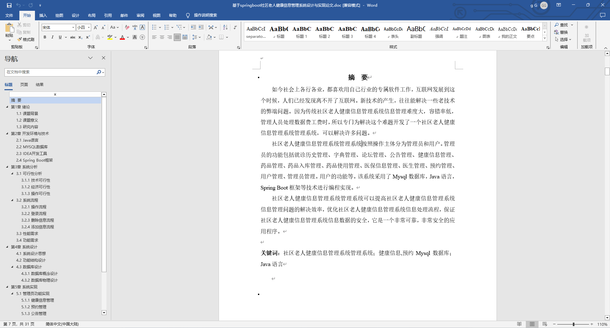
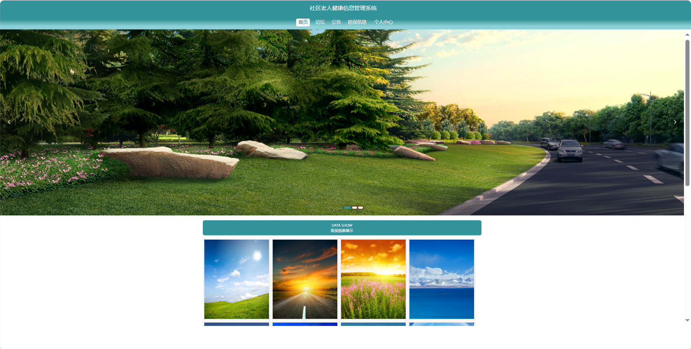
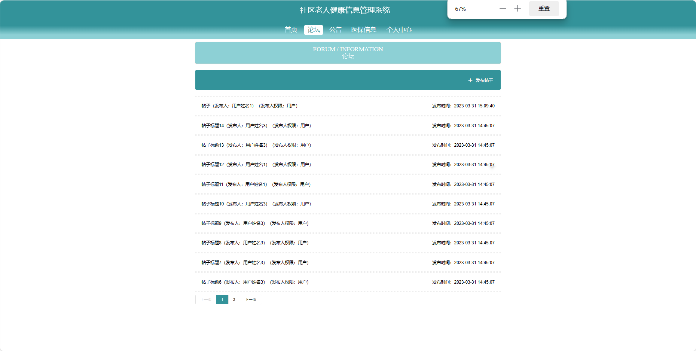
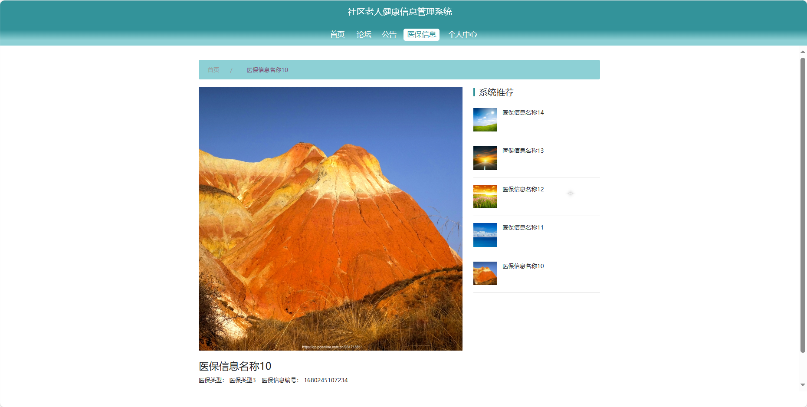
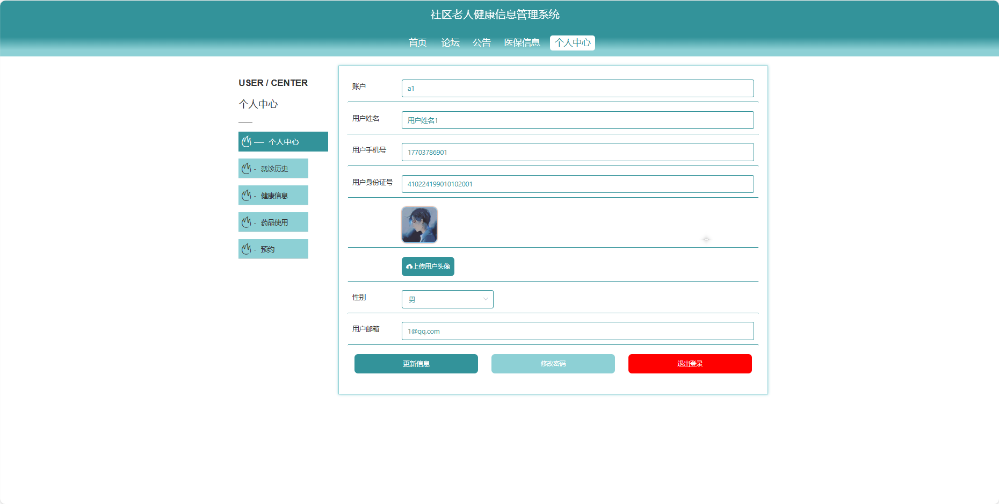

基于Springboot的社区老人健康信息管理系统（程序+论文）
=
### 完整代码获取地址：从戎源码网 ([https://armycodes.com/](https://armycodes.com/))
### 作者微信：19941326836  QQ：952045282 
### 承接计算机毕业设计、Java毕业设计、Python毕业设计、深度学习、机器学习
### 选题+开题报告+任务书+程序定制+安装调试+论文+答辩ppt 一条龙服务
### 所有选题地址https://github.com/nature924/allProject

一、项目介绍
---
基于Spring Boot框架实现的社区老人健康信息管理系统，系统包含三种角色：管理员、用户、医生主要功能如下。
### 【用户功能】
1. 首页：浏览系统。
2. 论坛：参与社区健康讨论和知识分享。
3. 公告：获取系统发布的重要公告和通知。
4. 医保信息：查看个人医保信息和政策更新。
5. 个人中心：管理个人信息、查看预约记录和健康信息。

### 【管理员功能】
1. 系统首页：查看系统整体。
2. 个人中心：管理管理员的个人信息。
3. 管理员管理：维护系统管理员的账户信息。
4. 医生管理：维护系统医生的账户信息。
5. 用户管理：维护系统用户的账户信息。
6. 预约管理：管理用户的医生预约记录。
7. 就诊历史管理：查看和管理用户的就诊历史。
8. 健康信息管理：记录和管理用户的健康信息。
9. 药品管理：管理系统的药品信息。
10. 药品入库管理：记录和管理药品的入库信息。
11. 药品使用管理：记录和管理药品的使用情况。
12. 医保信息管理：维护医保政策和信息。
13. 论坛管理：管理社区健康讨论和知识分享板块。
14. 公告管理：发布、编辑和管理系统的公告信息。
15. 基础数据管理：管理系统的基础数据等。
16. 轮播图信息：管理系统首页的轮播图展示。

### 【医生功能】
1. 首页：查看通知。
2. 个人中心：管理医生的个人信息。
3. 预约管理：查看和处理用户的医生预约。
4. 就诊历史管理：查看和管理用户的就诊历史记录。
5. 健康信息管理：记录和管理用户的健康信息。
6. 药品管理：查看和管理系统的药品信息。
7. 药品入库管理：记录和管理药品的入库信息。
8. 药品使用管理：记录和管理药品的使用情况。
9. 医保信息管理：查看和管理医保政策和信息。
10. 论坛管理：参与社区健康讨论和知识分享。
11. 公告管理：查看和参与系统的公告信息。
12. 轮播图信息：查看系统首页的轮播图展示。

二、项目技术
---
- 编程语言：Java
- 数据库：MySQL
- 项目管理工具：Maven
- 前端技术：VUE、HTML、Jquery、Bootstrap
- 后端技术：Spring、SpringMVC、MyBatis

三、运行环境
---
- 操作系统：Windows、macOS都可以
- JDK版本：JDK1.8以上都可以
- 开发工具：IDEA、Ecplise、Myecplise都可以
- 数据库: MySQL5.7以上都可以
- Tomcat：任意版本都可以
- Maven：任意版本都可以

四、运行截图
---
### 论文截图：

### 程序截图：

